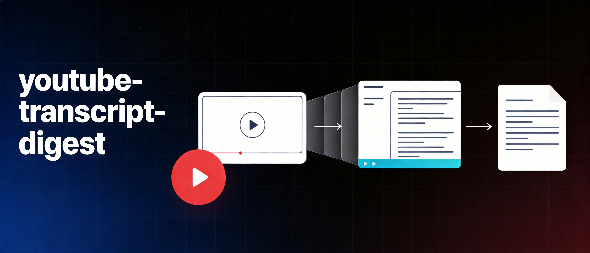

<div align="center">
  

  <h1>youtube-transcript-digest</h1>

  <p><a href="README.md">English</a> · <strong>简体中文</strong></p>

  <p><strong>Turn long-form video and podcast transcripts into evidence-aware Chinese insight documents.</strong></p>
  <p>不是“字幕搬运工”，而是一条从取稿、重组、证据审计到飞书交付的完整工作流。</p>

  <p>
    <a href="SKILL.md"></a>
    <a href="https://www.python.org/"></a>
    <a href="https://github.com/chengjialu8888/YouTube-to-doc/stargazers"></a>
    <a href="https://github.com/chengjialu8888/YouTube-to-doc/issues"></a>
  </p>

  <p>
    <a href="#为什么做这个-skill">为什么</a> ·
    <a href="#它能做什么">能力</a> ·
    <a href="#快速开始">快速开始</a> ·
    <a href="#工作流">工作流</a> ·
    <a href="#项目结构">项目结构</a>
  </p>
</div>

---

## 为什么做这个 Skill

长视频最浪费人的地方，不是“没有字幕”，而是字幕拿到以后仍然不能直接用：

- 逐句翻译保留了原顺序，也保留了原内容的松散和重复；
- 嘉宾的事实、自述、推断和营销口径混在一起；
- 摘要看起来完整，却没有原话、时间戳和证据边界；
- 文档写完了，但读者仍然不知道哪条判断值得带走。

`youtube-transcript-digest` 把问题拆成两层：

1. **重组**：围绕论点重排内容，让每一节只解决一个问题；
2. **审计**：核对利益关系、外部证据与“零提及”，逐节标注置信度。

最终交付的不是“更短的字幕”，而是一份**可引用、可回查、可判断**的中文洞见文档。

## 它能做什么

| 能力 | 结果 |
|---|---|
| 获取 transcript | 从 YouTube、Substack / Lenny’s Newsletter 或现有字幕文件取稿 |
| 统一字幕格式 | 处理 JSON3、VTT、SRT、网页 transcript panel 与纯文本 |
| 中文精译与重组 | 按用户提纲或对谈逻辑组织，不做机械逐句对译 |
| 置信度审计 | 区分“高可信 / 新信息且合理 / 营销口径” |
| 可回查引用 | 保留英文原话、中文翻译、说话人和时间戳 |
| 飞书文档交付 | TL;DR 锚点、判断式章节标题、可编辑飞书画板、总结清单 |
| 延伸材料处理 | 将节目郑重推荐的文章、论文或清单单独翻译成文档 |
| 中文语言质检 | 使用“判断先行—证据跟进—边界收束”的内置规范去 AI 味 |

### 输入与默认产物

| 你怎么说 | 默认交付 |
|---|---|
| “获取 transcript” | 带元信息与时间戳的本地 Markdown |
| “翻译全文” | 英文原稿 + 中文逐字稿 |
| “整理主要洞见” | 重组后的中文洞见飞书文档 |
| “按这个提纲整理” | 严格按提纲顺序组织的洞见文档 |
| “总结一下” | 更短的飞书摘要，不做全文精译 |

## 快速开始

### 1. 安装为 AIME Skill

把仓库放到你的用户 Skill 目录：

```bash
git clone https://github.com/chengjialu8888/YouTube-to-doc.git \
  user_skills/youtube-transcript-digest
```

也可以下载 ZIP 后，在 AIME 中作为用户 Skill 导入。Skill 的入口定义在 [`SKILL.md`](SKILL.md)。

### 2. 准备脚本依赖

```bash
python3 -m pip install requests
```

### 3. 直接用自然语言调用

```text
帮我获取这期 YouTube 视频的 transcript：<URL>
```

```text
用 youtube-transcript-digest 整理这场对谈。
重点回答：产品判断、关键决策、反常识观点和可执行建议。
```

```text
按下面提纲翻译并整理主要洞见：
1. ...
2. ...
3. ...
```

### 4. 只使用字幕脚本

从 YouTube 获取字幕并输出标准 Markdown：

```bash
python3 scripts/fetch_youtube_transcript.py '<youtube-url-or-id>' \
  --lang en \
  -o transcript.md
```

标准化已有字幕：

```bash
python3 scripts/format_transcript.py raw.vtt \
  --title '标题 — 逐字稿（Transcript）' \
  --meta '视频链接: https://...' \
  --meta '字幕来源: 官方人工字幕' \
  -o transcript.md
```

支持 `json3`、`vtt`、`srt`、`panel` 与 `plain`；脚本会自动识别格式、合并碎片并清理自动字幕的滚动重复。

> [!NOTE]
> YouTube 可能拦截数据中心 IP。抓取脚本返回退出码 `3` 时，应刷新登录 cookie 或改用网页 transcript 面板，不要盲目重试。

## 工作流

```text
视频 / 播客链接
      ↓
获取字幕与元信息
      ↓
标准化时间戳、说话人与来源
      ↓
检查利益关系、外部证据与“零提及”
      ↓
按提纲或叙事逻辑重组
      ↓
逐节标注置信度
      ↓
语言质检 + 可编辑飞书画板
      ↓
飞书洞见文档 / Markdown 逐字稿
```

### 置信度不是装饰

| 档位 | 判断标准 | 建议用法 |
|---|---|---|
| ✅ **高可信** | 被一手实测、官方材料或多个独立来源印证 | 可作为事实引用 |
| 💡 **新信息且合理** | 只有当事人视角，但细节自洽且符合公开时间线 | 可作产品史素材，不宜当成已证实事实 |
| ❗ **营销口径** | 与外部证据冲突，或属于无法证伪的自我评价 | 明确标红旗并写清冲突点 |

完整判定方法见 [`references/confidence-audit.md`](references/confidence-audit.md)。

### 输出文档长什么样

默认飞书文档包含：

1. 一张图看完；
2. 五条主要判断；
3. 来源、利益关系与置信度框架；
4. 带正文锚点的 TL;DR；
5. “主题：一句判断”格式的正文各章；
6. 每章末尾的置信度说明；
7. `Summary：可以搬走的 N 条`。

详细结构见 [`references/lark-doc-blueprint.md`](references/lark-doc-blueprint.md)。

## 设计原则

- **判断先行**：标题必须表达结论，不写“GTM 策略”这类空标签。
- **证据可回查**：关键原话保留英文、中文和时间戳。
- **事实与推断分开**：整理者推断统一加 `〔推断〕`。
- **审计先于写作**：先判断证据强弱，再决定正文语气。
- **不静悄悄删内容**：提纲外但重要的信息应单独收纳。
- **图片必须线上复核**：飞书画板交付前导出 preview 检查。
- **外部用户可复现**：核心语言规范和审计规则全部随仓库分发。

## 项目结构

```text
.
├── README.md                          # 英文项目主页
├── README.zh-CN.md                    # 中文说明文档
├── SKILL.md                           # Skill 入口与完整执行流程
├── assets/
│   └── banner.jpg                     # README 头图
├── references/
│   ├── confidence-audit.md            # 三档置信度审计方法
│   ├── fetching-transcripts.md        # YouTube / Substack 取稿手册
│   ├── lark-doc-blueprint.md          # 飞书文档结构与 XML 约定
│   └── translation-style.md           # 中文精译和去 AI 味规范
└── scripts/
    ├── fetch_youtube_transcript.py    # YouTube 字幕与元信息抓取
    └── format_transcript.py           # 多格式字幕标准化
```

## 边界与已知限制

- 本项目不绕过付费墙、DRM 或平台访问控制；
- 无字幕的视频需要额外 ASR，当前脚本不会自动下载音频转写；
- 自动字幕中的专有名词可能出错，关键引用应人工复核；
- 飞书文档和可编辑画板能力依赖运行环境提供相应的 Lark / Feishu 工具；
- 置信度档位是证据管理工具，不等于对嘉宾人格或产品价值的评价。

## 参与贡献

欢迎提交 Issue 或 Pull Request，尤其是：

- 新字幕来源适配；
- transcript 清洗与说话人识别改进；
- 真实案例中的误判与审计规则修正；
- 飞书文档结构和可视化质量优化。

提交前请阅读 [`CONTRIBUTING.md`](CONTRIBUTING.md)。

---

<div align="center">
  <strong>Transcript → Evidence → Insight</strong><br/>
  <sub>让长视频不只“被总结”，而是变成可验证、可复用的判断。</sub>
</div>
